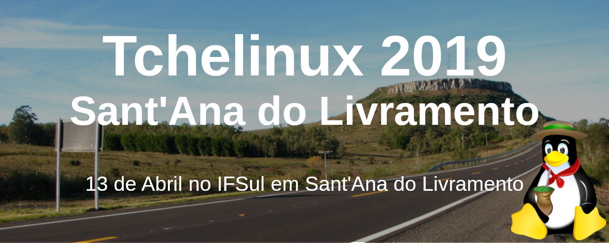

## Sobre

O grupo de usuários de Software Livre Tchelinux, em parceria com a [**Instituto Federal Sul-rio-grandense Campus Sant'Ana do Livramento**](http://www.santana.ifsul.edu.br/), tem o prazer de convidar a comunidade para participar do evento que ocorrerá no dia **13 de Abril de 2019 a partir das 8:30h** no IFSul em Sant'Ana do Livramento.

## Inscrições

 O evento tem **entrada franca**, porém os participantes são encorajados a doar 2kg de alimentos não perecíveis (exceto sal), que são doados a instituições de caridade da região. Os alimentos são recebidos no momento do credenciamento.

<a href="https://goo.gl/forms/74ax6cvRD73I7SLp2" target="_blank"><b>Clique aqui para fazer sua inscrição!</b></a>

**Importante:** Para preencher o formulário é necessário estar logado na sua conta do Google.

## Certificados

Serão fornecidos certificados digitais para os participantes do evento, que confirmaram sua presença. Para obtê-los, você deverá utilizar o email fornecido na sua inscrição para o evento.

**Importante:** Não esqueça de confirmar sua presença no credenciamento.

## Programação

| 
 Horário 
  |  
 Auditório 
                             | 
|:---------------------------:|:---------------------------------------------------------:|
| **08:30** | **Credenciamento** |
| **09:00** | **Abertura**   Todo o público   Equipe Tchelinux |
| **09:30** | [**Git em pequenos projetos**](#Git_em_pequenos_projetos)   Principiante   Sandro Custódio|
| **10:20** | [**Backups com Clonezilla**](#Backups_com_Clonezilla)   Principiante   Gill Velleda Gonzales|
| **11:10** | [**Framework Laravel**](#Framework_Laravel)   Principiante   Kevin Maciel Medeiros|
| **12:00** <td colspan=5>
**Intervalo para Almoço**
 |
| **13:30** | [**Introdução ao desenvolvimento Android com Kotlin**](#Introdução_ao_desenvolvimento_Android_com_Kotlin)   Principiante   Ricardo Robaina |
| **14:20** | [**Fugindo para as Colinas com Python**](#Fugindo_para_as_Colinas_com_Python)   Principiante   Julio Biason|
| **15:10** <td colspan=5>
**Coffee-Break**
 |
| **15:40** | [**...porque no MEU TEMPO!**](#...porque_no_MEU_TEMPO!)   Principiante   Fabio Beneditto|
| **16:20** | [**Dê a cara a tapa: Como se destacar no mercado de trabalho**](#Dê_a_cara_a_tapa:_Como_se_destacar_no_mercado_de_trabalho)   Principiante   Jerônimo Medina Madruga |
| **17:10** | **Encerramento**   Todo o público   Equipe Tchelinux |

## Palestras

### Git em pequenos projetos

Git em pequenos projetos, como num TCC, onde um pequeno grupo desenvolve em conjunto. O Git é "A" ferramenta de versionamento e software criada por Lunis Torvalds e que dominou o mercado atual. É não apenas gratuíta, é mais que isso, é um Software Livre, de ampla utilização e altamente reconhecido. Até os serviços web que suportam o Git são bons e gratuitos nestes casos.

### Sandro Custódio

Servidor Público da Justiça Federal com mais de 20 anos de TI, foco no Suporte a usuários, pitadas de infra e mais recentemente retornando ao desenvolvimento. Seu primeiro contato com Linux foi em 2003, e desde 2012 usa apenas Linux em casa. Já administrou UNIX e nos dias de hoje utiliza Ubuntu, Debian, Mint e CentOS. Tem como hobbies: Moto viagens, fotografia e astronomia.

### Backups com Clonezilla

A palestra apresentará as principais funcionalidades da ferramenta de backup de discos e partições CloneZilla. O objetivo é demonstrar como é possível utilizar a ferramenta para backup e restauração de imagens de partições de sistemas. O nível é para iniciantes e pretende encorajar o uso de soluções de software livre.

### Gill Velleda Gonzales

O palestrante é Técnico em Eletrônica e Tecnólogo em Sistemas para Internet pelo IFSUL, Mestre em Modelagem Computacional e Doutorando pelo mesmo Programa na Universidade Federal do Rio Grande. Atua como Professor de disciplinas de programação a 7 anos no IFSUL Campus Santana do Livramento. Utiliza várias ferramentas Open Source no seu dia-a-dia, inclusive o programa tema da sua palestra.

### Framework Laravel

Uma breve apresentação das principais funcionalidades, vantagens e desvantagens do maravilhoso framework laravel e como colocar o mesmo para funcionar no sua distro Linux. Além de uma breve abordagem sobre o mundo da programação web em geral de hoje em dia.

### Kevin Maciel Medeiros

Técnico em informática para internet e possui 1 ano de experiencia na área de programação.

### Introdução ao desenvolvimento Android com Kotlin

Atualmente, cerca de 88% dos dispositivos móveis utilizam o sistema operacional Android. No Google I/O de 2017, a linguagem de programação Kotlin foi incluída como uma linguagem padrão para o desenvolvimento desta plataforma. Essa palestra tem como objetivo introduzir o processo de desenvolvimento de aplicativos Android, utilizando a linguagem de programação Kotlin.

### Ricardo Robaina

Bacharel em Engenharia de Computação pela Universidade Federal do Pampa, foi honrado com o prêmio SBC como aluno destaque de sua turma. Apaixonado por computação e por Software Livre, possui experiência com desenvolvimento de simuladores, jogos sérios, classificadores e aplicações móveis, além de trabalhos relacionados ao desenvolvimento de aceleradores de hardware e co-design. Atualmente é aluno do  Programa de Pós-Graduação em Computação Aplicada (PPGCAP) da UNIPAMPA e voluntário do Tchelinux.

### Fugindo para as Colinas com Python

Uma introdução incomum ao Python. Ao invés de sair explicando cada um dos elementos da linguagem, iremos destrinchar uma simples aplicação que já existe, explicando as peculiaridades da linguagem.

### Julio Biason

Julio Biason participa de projetos open source desde 2000 é programador Python desde 2004.

### ...porque no MEU TEMPO!

...porque no MEU TEMPO é um comparativo das tecnologias atuais com 10+ anos atrás: conexão internet, áudio, multimídia, distribuições. O quanto que se pode mudar em tão pouco tempo?

### Fabio Beneditto

Desenvolvedor Web, Old School Nerd, simpatizante de F/OSS, segurança da informação e comunidades em geral. Voluntário Tchelinux desde 2016. Praticante de #mototerapia

### Dê a cara a tapa: Como se destacar no mercado de trabalho

Por que a Microsoft está dando treinamentos gratuitos sobre Python? Como a Apple consegue vender seus produtos a preço de ouro mesmo que não sejam os melhores no mercado? Por que cada vez mais profissionais contribuem para projetos de código aberto? Como cinquenta tons de cinza se tornou o best seller mais rapidamente vendido no Reino Unido? Por quanto tempo um profissional deve estudar para se destacar no mercado e ser considerado um especialista? Como evitar que você perca seu trabalho e seja trocado por um freelancer indiano? Existe uma fórmula exata para alcançar o sucesso? As respostas para essas perguntas e muitas outras serão apresentadas nesta palestra! Diversas de lições de grandes empresas e empresários de sucesso serão repassadas com o intuito de fornecer um "Norte" para aqueles que ainda iniciando a molhar os pés nos profundos mares do mundo trabalhista, demonstrando diversos sistemas e teorias que movem a economia moderna.

### Jerônimo Medina Madruga

Jerônimo Medina Madruga trabalha com suporte técnico e treinamento para educação a distância da Universidade Federal de Pelotas (UFPel). Tem formação em Técnico em Eletrônica pelo Instituto Federal Sul-Rio-Grandense (IFSUL) e é ocasionalmente atuante em grupos ligados a divulgação e desenvolvimento de software livre. Já realizou mais de 50 palestras em eventos internacionais, nacionais e regionais, sobre os temas mais variados possíveis, normalmente ligados a educação, programação, comunidades, CMS e administração de sistemas.

## Local

> **IFSul Campus Sant'Ana do Livramento**
> Paul Harris, 410 - Centro
> Sant'Ana do Livramento - RS

  <iframe src="https://www.google.com/maps/embed?pb=!1m14!1m8!1m3!1d13693.969605698769!2d-55.532844!3d-30.9008579!3m2!1i1024!2i768!4f13.1!3m3!1m2!1s0x0%3A0x6ac41211a41a9d12!2sIFSul+Sant&#39;Ana+do+Livramento!5e0!3m2!1sen!2sbr!4v1552014731159" width="800" height="450" frameborder="0" style="border:0" allowfullscreen></iframe>

## Apoio

### Institucional

### Patrocínio

### Divulgação

